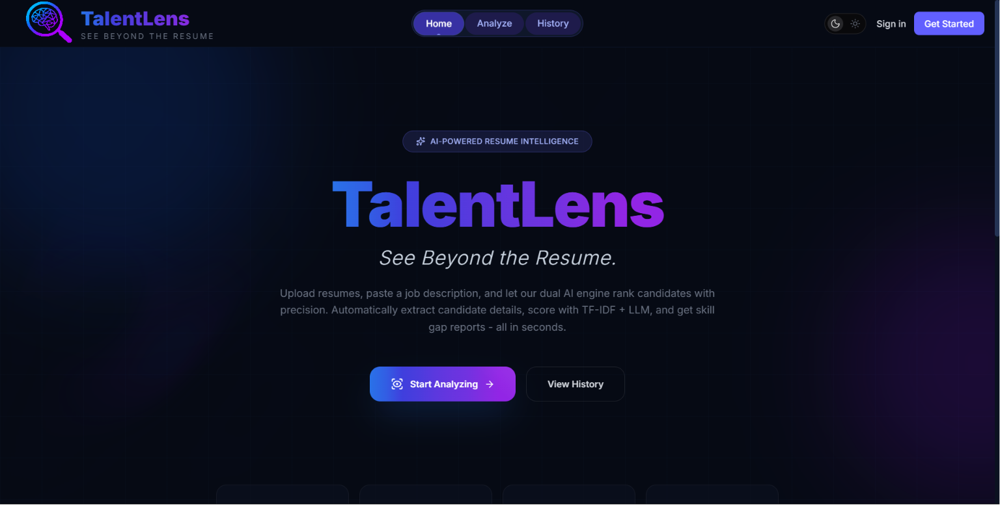
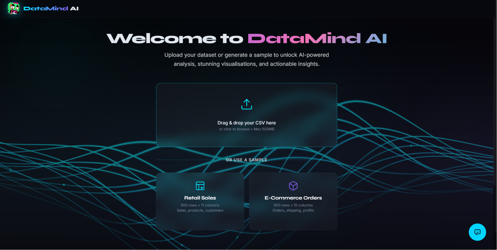
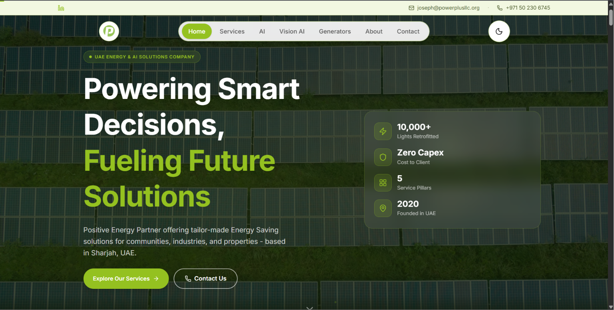

  

### Hi there, I'm Samuel Alex 👋

I'm an AI/ML student at SP Jain School of Global Management (Dubai), specializing in Deep Learning, NLP, Machine Learning, and Reasoning under Uncertainty. I care about shipping real, applied AI projects that solve concrete problems. When I'm not training models or wrangling data, you'll probably find me playing Basketball, Valorant, or Brawl Stars.

---

### 🚢 Featured Work

The projects below represent my focus on building end-to-end applied AI and data tools.

| **TalentLens** | **DataMind AI** |
|:---:|:---:|
|  |  |
| **AI Resume Screening Engine** Built an AI-driven screening tool utilizing TF-IDF and dual LLM scoring to objectively evaluate candidates. Achieved 86% LLM agreement across 2,484 validated resumes. | **Automated Data Analyst App** A web app deployed on Vercel for automated EDA. Supports CSV uploads, dynamic visualization (20+ chart types), and automated forecasting. |

| **Power Plus LLC** | **WHOOP & UAE Pulse** |
|:---:|:---:|
|  | 📊 |
| **Production Corporate Website** Built and deployed a performant, production-ready company site for Power Plus LLC. Hosted and optimized on Cloudflare Pages. | **Data & Analytics Dashboards** Engineered comprehensive data dashboards including a custom WHOOP fitness tracker and the UAE Pulse data project. |

---

### 🏗️ Currently Building

- **CollusionGraph**: A Graph Neural Network (GNN) system designed to detect coordinated fraud patterns, specifically targeting money laundering and bid-rigging networks.
- **DCGAN Image Restoration**: Developing a conditional DCGAN architecture integrating U-Net skip connections for advanced image restoration and enhancement.

---

### 🛠️ Skills & Arsenal

**AI / ML / Data** 

**Engineering / Web** 

**Deployment / Tools** 

---

### 📈 Activity & Stats

  
  

 

  <!-- pacman-contribution-graph -->
  <!-- /pacman-contribution-graph -->

---

  

